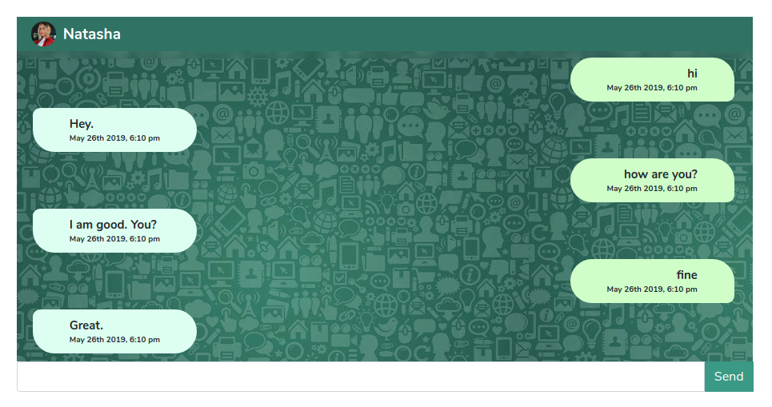

# socket-vue-chat

Simple Chat Using Socket.io and Vue JS NodeJS ExpressJs.

### ScreenShot



### Installing

run these command in terminal.

For FrontEnd, Go to Root Directory

```
npm install
npm run serve

```
For Server, Go to Server directory

```
npm install
node server.js

```

## Author

* **Abijit Biswas** - [abijitb](https://github.com/abijitb)

## License

This project is licensed under the MIT License - see the [LICENSE.md](LICENSE.md) file for details
